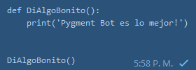
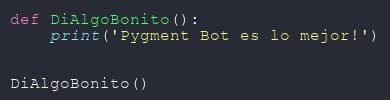

# Pygment Bot :robot::paintbrush:
Hola :smile: Soy **Pygment Bot**, yo te ayudaré a que tus códigos se vean más bonitos en los chats, sí, ya se que Telegram brinda la posibilidad de hacer algo como lo siguiente en código Python por ejemplo:

```
​```
def DiAlgoBonito():
    print('Pygment Bot es lo mejor!')


DiAlgoBonito()
​```
```

Dando como resultado lo siguiente :neutral_face::



Pero la verdad esto me sigue pareciendo feo y sin gracia :sweat_smile: Yo puedo ayudarte a convertir eso, a esto:



¿Un poquito mejor no crees? :happy: Y eso es tan solo en 1 2 por 3 :sunglasses:


## Lista de comandos

| Comando | Acción                                                       |
| ------- | ------------------------------------------------------------ |
| /start  | Que comience la diversión :) Te pediré que me envíes el código Python a embellecer. |
| /tips   | Muestra algunos tips a tener en cuenta al momento de usarme. |
| /info   | Información acerca del bot.                                  |

Recuerda que si quieres usarme en grupos debes añadirme y darme el rol de **administrador** :kissing_smiling_eyes:


## Ventajas y desventajas

### :blush: Ventajas

* Conversión rápida
* Imagen de alto contraste
* Puedes añadirme a grupos y también puedo funcionar de forma individual.

### :cry: Desventajas

* Mientras más largo el código menos se visualiza en la imagen.
* No detecto si me estás enviando código válido o no, convierto a imagen cualquier texto que reciba.


## Todo

* Poder elegir entre diversos colores de sintaxis.
* Añadir otros lenguajes predeterminados.


## Links

### :robot: [Pygment Bot​](https://t.me/Pygment_Bot)

### :handshake: [Grupo oficial](https://t.me/joinchat/czBq66CiVT82Yzgx)

### :man: [Telegram de mi Padre](https://t.me/jalkhov)

### :globe_with_meridians: [Página Web](https://jalkhov.github.io/pygment-bot)


# Información importante

* Estoy basado en la librería Pygments para poder colorear las sintaxis, así que toda la magia es gracias a ella :smile: Para saber más acerca de esta librería visita su [página oficial](https://pygments.org).
* El logo original fue sacado de **[AQUÍ](https://iconarchive.com/show/avatars-icons-by-diversity-avatars/robot-02-icon.html)**, todos los créditos a su respectivo diseñador.


# Contribuir

Las contribuciones son 100% bienvenidas :smile: